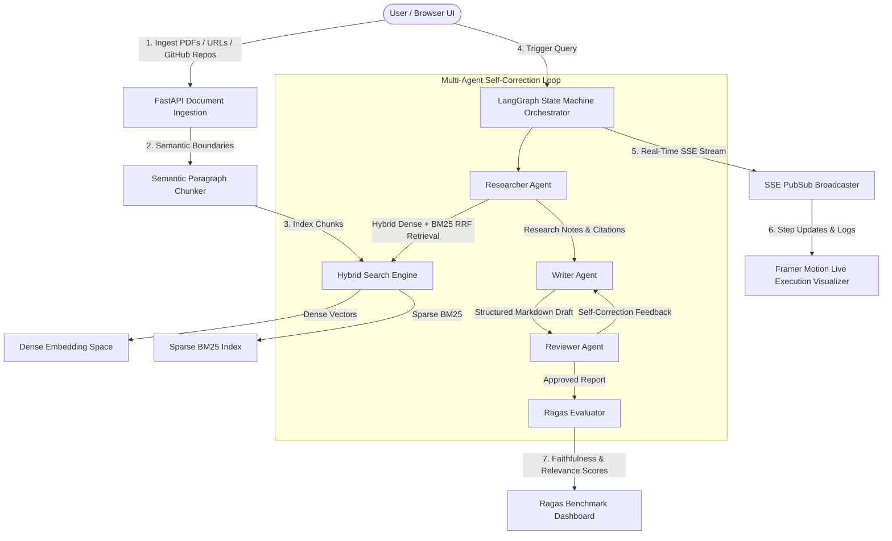

# 🚀 Synthetix AI - Multi-Agent RAG & Knowledge Synthesizer

[](https://multi-agent-rag-synthesizer.vercel.app/)
[](https://www.python.org/)
[](https://fastapi.tiangolo.com/)
[](https://langchain.com/)
[](LICENSE)

> A production-grade enterprise SaaS platform for ingesting complex multi-source documents (PDFs, Web URLs, GitHub Repositories), executing autonomous **LangGraph multi-agent workflows** with **Hybrid Dense + Sparse BM25 RRF Search**, streaming **real-time execution steps via SSE**, and evaluating reports against **Ragas quality benchmarks**.

🌐 **Live Demo**: [https://multi-agent-rag-synthesizer.vercel.app/](https://multi-agent-rag-synthesizer.vercel.app/)

---

## 🏛️ Target Architecture & Workflow



---

## 🔥 Key Technical Highlights

1. **Document Ingestion & Hybrid RAG Engine (RRF)**
   - **Multi-Source Parsers**: PDF text & table extractor (`PyMuPDF`), HTML web scraper (`BeautifulSoup`), and GitHub repository file loader.
   - **Semantic Chunking**: Splits content at paragraph & section boundaries (`#`, `##`) to preserve section context.
   - **Reciprocal Rank Fusion (RRF)**: Merges dense vector representations and sparse BM25 keyword rankings:
     $$RRF\_Score(d) = \sum_{m \in \{Dense, Sparse\}} \frac{1}{k + r_m(d)}$$

2. **LangGraph Multi-Agent Orchestration Loop**
   - **Researcher Agent**: Queries hybrid search engine, extracts top RRF chunks, and synthesizes findings with citations.
   - **Writer Agent**: Converts findings into structured, publication-ready markdown reports.
   - **Reviewer Agent (Self-Correction Loop)**: Audits reports for factual consistency, tone, and hallucination risk. Dispatches feedback to Writer Agent if quality thresholds are not met.

3. **Real-Time Streaming & Visualizer**
   - **FastAPI SSE Endpoint**: `/api/v1/stream/{project_id}` streams node transitions and logs in real-time.
   - **Framer Motion Graph Visualizer**: Renders active state glowing nodes, completion badges, and iteration counters.

4. **Ragas Benchmark Dashboard**
   - Computes automated quality metrics: **Faithfulness**, **Answer Relevance**, **Context Precision**, and **Context Recall**.

---

## 🛠️ API Specification

| Method | Endpoint | Description |
| --- | --- | --- |
| `POST` | `/api/v1/projects/` | Create project & ingest PDFs, URLs, GitHub repos |
| `POST` | `/api/v1/query/` | Trigger LangGraph multi-agent research query |
| `GET`  | `/api/v1/stream/{project_id}` | Real-time SSE endpoint streaming agent updates |
| `GET`  | `/api/v1/reports/{report_id}` | Fetch final markdown report and Ragas score JSON |

---

## 💻 Local Quick Start

```bash
# 1. Clone repository
git clone https://github.com/FAISALREHMAN-AI/multi-agent-rag-synthesizer.git
cd multi-agent-rag-synthesizer

# 2. Run Backend
cd backend
python -m venv .venv
.\.venv\Scripts\python.exe run.py

# 3. Run Frontend
cd ../frontend
npm install
npm run dev
```

---

## 📄 License
Distributed under the MIT License. See `LICENSE` for more information.
