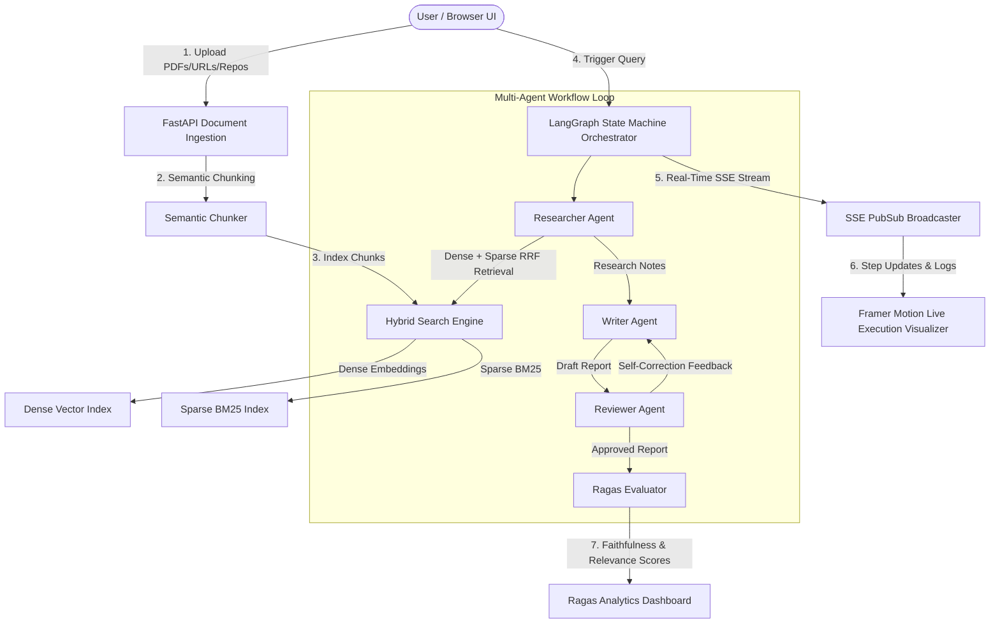

# Synthetix AI - Multi-Agent RAG & Knowledge Synthesizer

> Production-Grade SaaS Platform for Ingesting Complex Documents (PDFs, Web URLs, GitHub Repositories), Executing Multi-Agent LangGraph Workflows with Hybrid Dense + Sparse BM25 RRF Search, Real-Time SSE Event Streaming, and Ragas Evaluation Benchmarks.

---

## 🌟 Key Architecture & Features



### 1. Document Ingestion & Hybrid RAG Engine (RRF)
- **Multi-Source Parsers**: PDF table & text extraction via PyMuPDF, Web scraping via BeautifulSoup, and GitHub repository code parser.
- **Semantic Chunking**: Splits content at paragraph & section boundaries (`#`, `\n\n`) to preserve contextual integrity.
- **Reciprocal Rank Fusion (RRF)**: Merges dense vector representations and sparse BM25 keyword rankings using:
  $$RRF\_Score(d) = \sum_{m \in \{Dense, Sparse\}} \frac{1}{k + r_m(d)}$$

### 2. LangGraph Multi-Agent Workflow
- **Researcher Agent**: Queries hybrid search engine, extracts top RRF chunks, and synthesizes key findings with source citations.
- **Writer Agent**: Converts findings into structured, publication-ready markdown reports.
- **Reviewer Agent (Self-Correction Loop)**: Inspects drafts for hallucinations, factual alignment, and tone. Dispatches feedback to the Writer Agent if revision is needed.

### 3. Real-Time Streaming & Visualizer (SSE + Framer Motion)
- **FastAPI SSE Endpoint**: `/api/v1/stream/{project_id}` streams node transitions and logs in real-time.
- **Framer Motion Graph Visualizer**: Renders active state glowing nodes, completion badges, and iteration counters.

### 4. Ragas Metrics Dashboard
- Computes automated quality metrics: **Faithfulness**, **Answer Relevance**, **Context Precision**, and **Context Recall**.

---

## 🛠️ API Specification

| Method | Endpoint | Description |
| shadow | --- | --- |
| `POST` | `/api/v1/projects/` | Create project & ingest PDFs, URLs, GitHub repos |
| `POST` | `/api/v1/query/` | Trigger LangGraph multi-agent research query |
| `GET`  | `/api/v1/stream/{project_id}` | Real-time SSE endpoint streaming agent updates |
| `GET`  | `/api/v1/reports/{report_id}` | Fetch final markdown report and Ragas score JSON |

---

## 🚀 Quick Start Guide

### Prerequisites
- Python 3.11+
- Node.js 18+ / npm

### 1. Backend Setup
```bash
cd backend
pip install -r requirements.txt
python run.py
```
*Backend runs on `http://localhost:8000` (Swagger docs: `http://localhost:8000/docs`)*

### 2. Frontend Setup
```bash
cd frontend
npm install
npm run dev
```
*Frontend runs on `http://localhost:3000`*

### 3. Docker Compose (Optional)
```bash
docker-compose up --build
```
